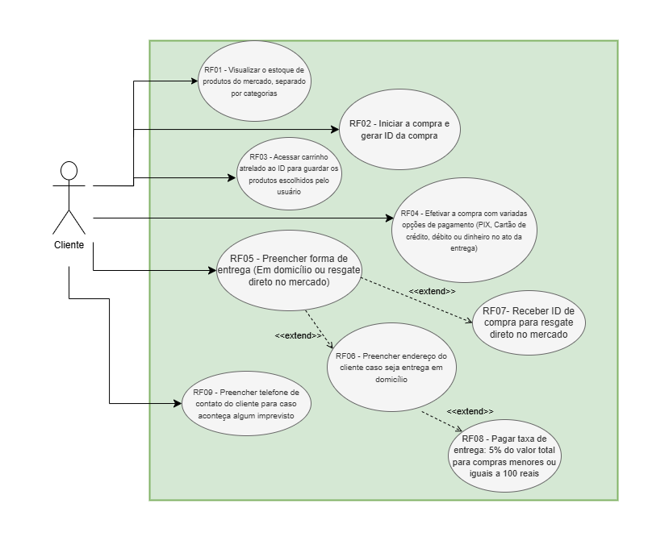

[Ir ao README.md](../../../README.md "Ir para README.d")

# Criação dos Diagramas UML (Linguagem de Modelagem Unificada)

## Diagrama de Caso De Uso

Baseado nos [Requisitos Funcionais](../../Requisitos/EspecificaçãoDeRequisitosFuncionais.md) que foram levantados na fase anterior, foi criado o Diagrama de Caso de Uso. Nosso diagrama possui um ator principal, que é o cliente.

## Diagrama de Classe

No nosso Diagrama de Classe foram definidas todas as classes que farão nosso sistema ganhar vida. As classes serão utlizadas no Back-End, fazendo com que os [Requisitos Funcionais e as Regras de Negócio](../../Requisitos/EspecificaçãoDeRequisitosFuncionais.md) sejam atendidas.
Aqui temos uma classe *Produto_Compra* que servirá para relacionar a classe *Produto* e a classe *Compra*, armazenando a quantidade de vezes que um produto existe dentro da compra e seu valor unitário. Dessa forma, podemos criar um sistema de carrinho.

