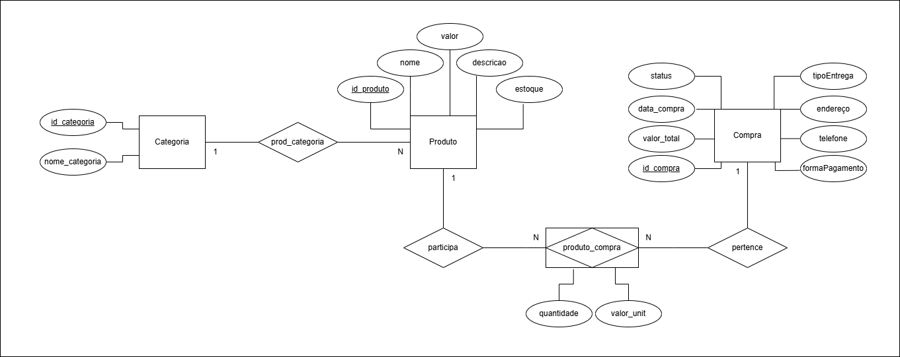
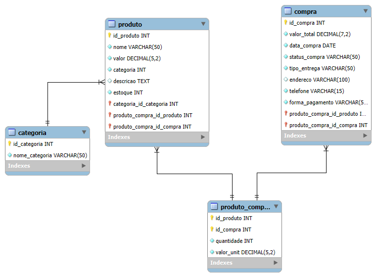

[Ir ao README.md](../../../README.md "Ir para README.d")

# Modelagem Conceitual, Lógica e Física do Banco de Dados do projeto Mercadinho Online

## Modelagem Conceitual
Baseado no [Diagrama De Classe](../Diagramas-UML/diagrama-de-classe.drawio.png), o Modelo Conceitual mostra as entidades, seus atributos, relacionamentos e cardinalidades dentro do Banco de Dados. Nesse modelo, há também a entidade associativa *produto_compra* que faz o papel do carrinho para armazenar os produtos escolhidos pelo usuário. Foi criado utilizando a ferramenta _Draw.io_.




## Modelagem Lógica
Como estou utilizando o _MySQL WorkBench_, tenho a opção de criar a Modelagem Lógica de forma automática, a partir da Modelagem Física.




## Modelagem Física

Modelagem Física utilizando Banco de Dados _MySQL_

```
CREATE DATABASE mercadinhoOnline;
USE mercadinhoonline;

CREATE TABLE Categoria (
	id_categoria INT AUTO_INCREMENT PRIMARY KEY,
	nome_categoria VARCHAR(50) UNIQUE NOT NULL
);

CREATE TABLE Produto (
	id_produto INT AUTO_INCREMENT PRIMARY KEY,
    nome VARCHAR(50) UNIQUE NOT NULL,
    valor DECIMAL(5,2) NOT NULL,
    categoria INT NOT NULL,
    descricao TEXT,
    estoque INT NOT NULL,
    FOREIGN KEY (categoria) REFERENCES categoria(id_categoria)
);

CREATE TABLE Compra (
	id_compra INT AUTO_INCREMENT PRIMARY KEY,
    valor_total DECIMAL(7,2) NOT NULL,
    data_compra DATE NOT NULL,
    status_compra VARCHAR(50) CHECK ( status_compra IN ('PENDENTE', 'FINALIZADO', 'CANCELADO')) NOT NULL,
    tipo_entrega VARCHAR(50) CHECK ( tipo_entrega IN ('DOMICÍLIO', 'RESGATE')) NOT NULL,
    endereco VARCHAR(100) NULL,
    telefone VARCHAR(15) NOT NULL,
    forma_pagamento VARCHAR(50) CHECK ( forma_pagamento IN ('PIX', 'CRÉDITO', 'DÉBITO', 'DINHEIRO')) NOT NULL
);

CREATE TABLE Produto_Compra (
    id_produto INT NOT NULL,
    id_compra INT NOT NULL,
    quantidade INT NOT NULL,
    valor_unit DECIMAL(5,2) NOT NULL,
    PRIMARY KEY (id_produto, id_compra),
    FOREIGN KEY (id_produto) REFERENCES produto(id_produto),
    FOREIGN KEY (id_compra) REFERENCES compra(id_compra)
);
```

