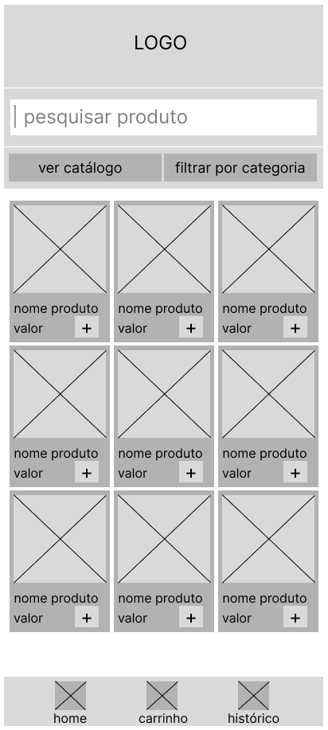

[Ir ao README.md](../../../README.md "Ir para README.d")

# Criação do Mapa de Site e Wireframes

## Mapa de Site

Representação visual da estrutura do Site. Um guia para facilitar a navegação.

## Wirefames

Os Wireframes foram criados esboçando as telas definidas no Mapa de Site. Até então, foram criados somente os protótipos Mobile. Deverão ser criados posteriormente os esboços Web.

Foram criados usando o Figma. 

[Link das Telas](https://www.figma.com/design/l140sUsQCXrcC5s0D0BjIR/projeto-mercadinho-online?node-id=0-1&p=f&t=ll35q1yGRSjP2xrw-0 "Figma")

[Link da Apresentação Figma](https://www.figma.com/proto/l140sUsQCXrcC5s0D0BjIR/projeto-mercadinho-online?node-id=0-1&p=f&t=ll35q1yGRSjP2xrw-0&scaling=scale-down&content-scaling=fixed&page-id=0%3A1&starting-point-node-id=1%3A3 "Figma")

### Home

Na home, será apresentado todo o catálogo do mercado. O usuário terá a opção de filtar os produtos por categoria. Ao pressionar o botão de '+', caso nenhuma compra tenha sido iniciada, será criada uma nova compra.

### Carrinho

Ao iniciar uma nova compra, será gerado um novo carrinho com um ID, status da compra, valor total e os produtos adicionados. Podendo incrementar ou decrementar a quantidade de um produto, interferindo no valor total da compra. O usuário poderá seguir para a finalização da compra ou se preferir, poderá excluir o carrinho.

### Histórico de Compras

No histórico de compras, ficará todo o registro de compras daquele usuário. Como não terá sistema de login, o histórico será armazenado através do Local Storage. A partir do histórico, o usuário poderá identificar uma compra que ele realiza frequentemente e repeti-la.

### Registro de Compra

Cada registro no histórico de compras dará acesso a uma visão mais detalha da compra. A partir dessa tela o usuário poderá ver um resumo da compra ou seguir para a repetição da compra. Caso opte por comprar novamente, será gerado um novo carrinho com as mesmas compras porém com um novo ID.

### Pagamento

Na tela de pagamento, o usuário poderá escolher a forma que deseja efetuar o pagamento e como deseja receber a compra, além de preencher o telefone e também o endereço, caso opte por entrega a domicílio.

### Resumo da Compra

Aqui será apresentado o resumo da compra e um botão para ver a compra detalhatamente, direcionando para o registro da compra.

